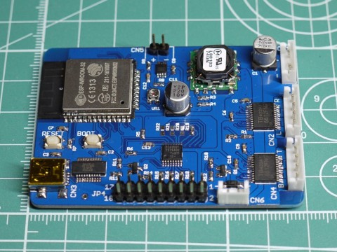

GPduino-T
=========
## 概要
GPduino-Tは、ESP32搭載のWiFiラジコン戦車制御ボードです。



以下のことができます。

* DCモータ4個を制御 (最大連続1.2A / 最大瞬間3.0A)
* LED 8個を制御
* サウンド出力
* 赤外線信号(38kHz変調)の送受信
* 電源 3.6V～7.2V (4.8～6V推奨)、電源電圧を監視
* WiFiによる通信　(APにもSTAにもなれる)

また、Waltersons製 1/24 バトルタンクシリーズ互換のIRバトルが可能なファームウェアを提供します。

## ファイル一覧

* hard/GPduino-T/
	* GPduino-T.sch/brd: 回路/基板設計データ(Eagle形式)
	* GPduino-T.pdf: 回路図(PDF)
	* GPduino-T_BOM.xlsx: BOMリスト(Excel形式)
	* GPduino-T.GBL/GBO/GBP/GBS/GML/GTL/GTO/GTP/GTS/TXT: ガーバデータ
* firm/GPduinoT/
	* GPduinoT.ino: ラジコン戦車のArduinoスケッチ
	* *.h, *.cpp: ラジコン戦車のための各種クラス宣言と実装 
* data/
	* cannon.bin: 砲撃音のサウンドデータ
* LICENSE: Apache Licence 2.0です。
	* ただし、回路/基板設計は、Creative Commons Attribution Share-Alike 3.0です。
* README.md これ

## Arduino開発環境のセットアップ
GPduino-T はESP32を搭載しており、Arduino IDEでファームウェアを開発できます。

ここでは、Windows10での開発環境のセットアップについて説明します。他のプラットフォームでも同様です。適宜読み替えてください。

* まず、ArduinoIDE をインストールしておきます。 (ここでは 1.8.2 を使用)
* 残念ながら、Arduino Core for the ESP32はArduino IDEのボードマネージャには対応しておらず、以下のように手作業でインストールする必要があります。
* まず、以下のリポジトリからクローンします。もしもGitが使えない場合、こちらからDownload ZIPして解凍してもかまいません。アップデートの時の手間だけの問題かと思います。
	* ソース: https://github.com/espressif/arduino-esp32.git
    * 保存先: C:/Users/[YOUR_USER_NAME]/Documents/Arduino/hardware/espressif/esp32
* 次に、下記のバイナリを実行します。
	* C:/Users/ユーザ名/Documents/Arduino/hardware/espressif/esp32/tools/get.exe
* DOS窓が開いてインストールが実行されます。あとはDOS窓が閉じるまで待ちます。
* ノートン先生をはじめ一部のセキュリティソフトは、いくつかのバイナリをウィルスとして検出してしまうようです。(ノートン先生ではTrojan.Gen.8!cloudとして検出されます。)
* Arduino IDEの[ツール] > [マイコンボード]で[ESP32 Dev Module]を選択します。
* [ツール] > [Upload Speed]で[115200]を選択します。

## Arduinoスケッチ (Waltersonsバトルタンク互換)

Waltersons製 1/24 バトルタンクシリーズ互換の赤外線バトルが可能な以下のファームウェアを提供しています。
* firm/GPduinoT/
	* GPduinoT.ino: ラジコン戦車のArduinoスケッチ
	* *.h, *.cpp: ラジコン戦車のための各種クラス宣言と実装

Waltersonsのバトルタンクの制御基板と置き換える場合には、[こちら](http://d.hatena.ne.jp/licheng/20170421/p1)の結線表を参照してください。

## Arduinoスケッチ (ユーザー独自)
ユーザーが独自にファームウェアを作成する場合は、上記のスケッチを参考にしてください。

ラジコン戦車のための各種クラスを利用するためには、Wire.h と GPduinoR.h をインクルードします。
``` c
#include <Wire.h>
#include "GPduinoR.h"
```
すると、以下のクラスが使用できます。詳細はソースを参照してください。

* Battery: バッテリー電圧の取得
* DcMotor: DCモータの制御
* IR: 赤外線信号の送受信
* Led: LEDの制御
* Solenoid: ソレノイドの制御
* Sound: サウンドの出力
* UdpComm: WiFiによるUDP/IP通信

## Arduinoスケッチの書き込み
* GPduino-TをUSBケーブルでPCに接続します。
* 書き込み時もUSBからの給電は受けません。CN1から給電してください。
* Windows 7以降であればドライバが自動でインストールされ、COMポートとして認識されます。
	* 自動でデバイスが認識されない環境ではFTDIのデバイスドライバをインストールしてください。
* [ツール] > [シリアルポート]でESP32のポートを選択する。
* BOOTボタン(SW2)を押し下げた状態で、RESETボタン(SW1)を押して離します。これで書き込みモードになります。
* Uploadボタンで、ファームウェアを書き込みます。

## サウンドデータの書き込み
Arduinoスケッチとは別にサウンドデータもESP32のフラッシュメモリに書き込みます。

GPduinoT.ino は、フラッシュメモリの0x100000番地から61440バイトの領域に砲撃音のサウンドデータ (data/cannon.bin) が格納されているものとしています。

書き込みツール esptool.exe のあるディレクトリにパスを通しておきます。Windows10なら通常は下記ディレクトリになります。
```
C:\Users\ユーザ名\Documents\Arduino\hardware\espressif\esp32\tools
```
ESP32のBOOTボタン(SW2)を押し下げた状態で、RESETボタン(SW1)を押して離して書き込みモードにします。シリアルポートをPCに接続し、PCでCOMポート番号を確認します。ここではCOM3であったとします。そこで下記のコマンドを実行します。

```
esptool.exe -c esp32 -p COM3 -b 115200 write_flash 0x100000 data.bin
```

このサウンドデータは、下記のフォーマットのWAV形式ファイルから、先頭44バイトのヘッダを削除し、さらに符号なし16ビット値形式に変換するために各サンプル値に+0x8000したものです。
* サンプリング周波数 11.025kHz
* 符号つき16ビット量子化
* モノラル

## 既知の問題点

* 7.2V電源使用時に発熱が大きい。(3端子レギュレータをDCDCコンバータに置き換えるべき)
* サウンドのボリューム調整のためのトリマを追加すべき。
* サウンド再生時にCPUがクラッシュする場合があるため、クラッシュ回避のごまかし処理を入れている。